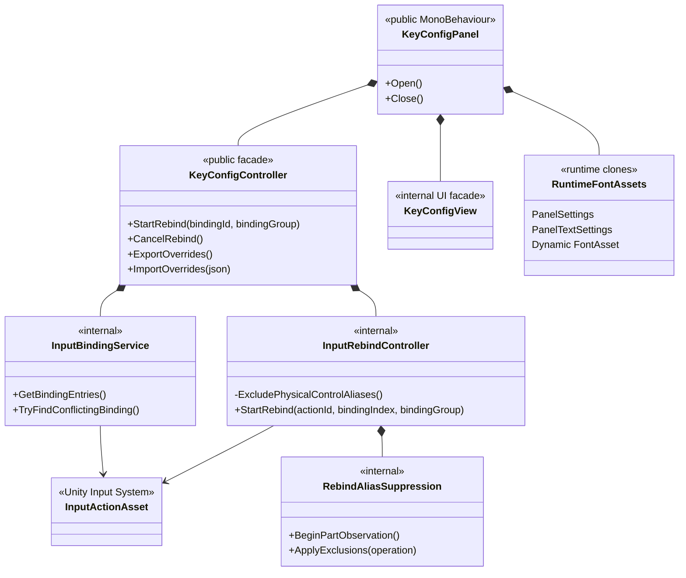
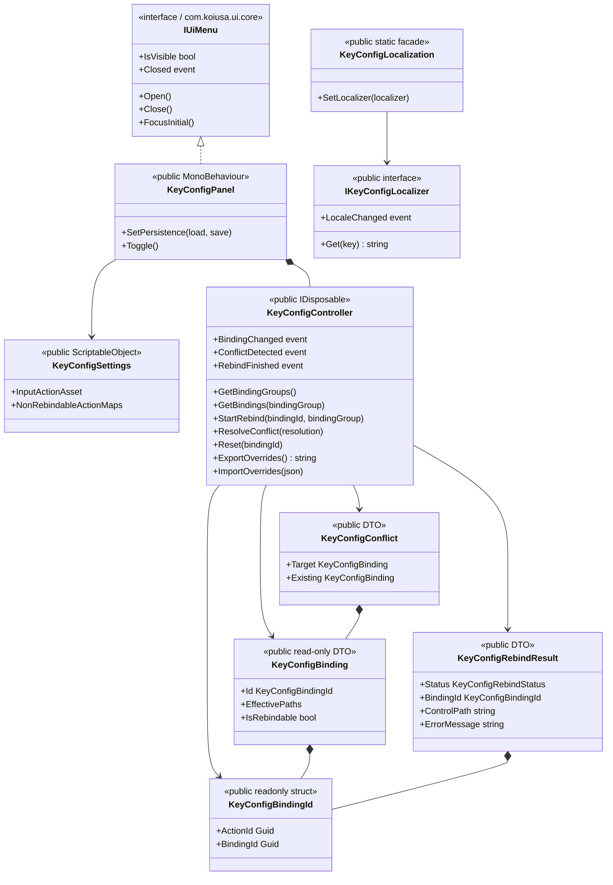

# KeyConfig Architecture

この文書をKeyconfigのクラス構成図と公開インターフェース構成図の正本とします。利用方法、導入、テスト手順は[Keyconfig.md](Keyconfig.md)、公開API再編の履歴は[KeyConfigPublicApiMigration.md](KeyConfigPublicApiMigration.md)を参照してください。

## クラス構成

`InputRebindController`は全リバインドでDualShock／DualSense固有の`leftTriggerButton`／`rightTriggerButton`を候補から除外します。`RebindAliasSuppression`は複合Bindingの各パート確定時に同じStateイベントで変化したControlを記録し、後続パートへの重複登録を防ぎます。

## 公開インターフェース構成

Unity UIを利用する側は`KeyConfigPanel`を入口とし、保存先だけを`SetPersistence`のdelegateで注入します。UIを持たない利用側は`KeyConfigController`を直接生成し、GUIDベースの`KeyConfigBindingId`と読み取り専用DTOを通じて操作します。Localizationの差し替えは`IKeyConfigLocalizer`を`KeyConfigLocalization`へ登録します。
